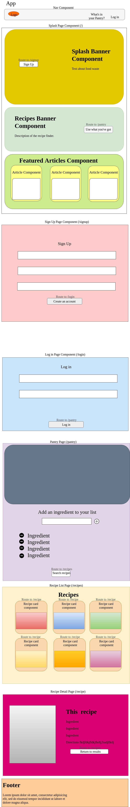

# Food Waste Recipes

#### By _**Katlin Anderson**_

## Description
_View the deployed version here N/A

_A full stack web app using a C# backend and React front end._

_This project was bootstrapped with [Create React App](https://github.com/facebook/create-react-app)._

## Setup/Installation Requirements

* _$ git clone https://github.com/KNBAnderson/tap-room;_
* __

## Specs



## Installation Requirements
* Run in browser

## Known Bugs
There are no known bugs.

## Technologies Used

* _HTML_
* _CSS_
* _JavaScript_
* _React_
* _Node_
* _Jest_
* _ESLinter_
* _Babel_
* _C#_
* _.Net_
* _AWS Lambda_
* _AWS Cognito_
* _AWS DynamoDB_
* _AWS S3 Bucket_

### License

*This software is licensed under the GPL license.*

Copyright (c) 2019 **_Katlin Anderson_**


This starter project consists of:
* serverless.template - an AWS CloudFormation Serverless Application Model template file for declaring your Serverless functions and other AWS resources
* Function.cs - class file containing the C# method mapped to the single function declared in the template file
* aws-lambda-tools-defaults.json - default argument settings for use with Visual Studio and command line deployment tools for AWS

You may also have a test project depending on the options selected.

The generated project contains a Serverless template declaration for a single AWS Lambda function that will be exposed through Amazon API Gateway as a HTTP *Get* operation. Edit the template to customize the function or add more functions and other resources needed by your application, and edit the function code in Function.cs. You can then deploy your Serverless application.

## Here are some steps to follow to get started from the command line:

Once you have edited your template and code you can deploy your application using the [Amazon.Lambda.Tools Global Tool](https://github.com/aws/aws-extensions-for-dotnet-cli#aws-lambda-amazonlambdatools) from the command line.

Install Amazon.Lambda.Tools Global Tools if not already installed.
```
    dotnet tool install -g Amazon.Lambda.Tools
```

If already installed check if new version is available.
```
    dotnet tool update -g Amazon.Lambda.Tools
```

Execute unit tests
```
    cd "food-waste/test/food-waste.Tests"
    dotnet test
```

Deploy application
```
    cd "BlueprintBaseName/src/BlueprintBaseName"
    dotnet lambda deploy-serverless
```
